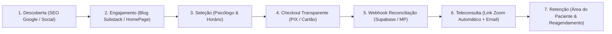

# CONTEXTO DO PROJETO: Doxologos Psicologia (Plataforma de Gestão Clínica e Atendimento)

**Visão Geral:** 
Plataforma completa de saúde mental e gestão clínica para a **Doxologos Psicologia** (v2.2), operando em produção em `https://novo.doxologos.com.br`. O sistema oferece agendamento de consultas 24/7, checkout transparente com Mercado Pago (PIX QR Code inline, Cartão Direto e Boleto), teleconsultas com reuniões Zoom geradas automaticamente via Server-to-Server OAuth, área logada do paciente, painel administrativo do profissional/gestor, módulo de eventos/workshops, blog integrado com Substack e notificações automatizadas via SMTP Hostinger.

---

## ESTRATÉGIA DE NEGÓCIO E ROADMAP

### [X] FASE 1: Core Booking & Lançamento Comercial (Concluída - v1.0 / v1.5)
- **Agendamento 24/7:** Escolha de psicólogo, especialidade, data/horário e cupons de desconto.
- **Pagamentos v1:** Integração inicial Mercado Pago e PIX.
- **Telemedicina v1:** Criação automática de salas Zoom via Edge Function.
- **Comunicação v1:** Envio de emails transacionais (confirmação, lembretes) via SMTP Hostinger.

### [X] FASE 2: Checkout Transparente, Gestão Admin e Blog (Concluída - v2.0 / v2.2)
- **Checkout Transparente (v2.0):** Pagamento com Cartão Direto sem redirecionamento externo e PIX inline com QR Code dinâmico + copia e cola. Webhook com reconciliação idempotente.
- **Painel Administrativo & Reembolso:** Gestão de usuários, agenda de atendimentos, relatórios financeiros, formulário de reembolso manual com comprovante e nota do paciente.
- **Eventos e Workshops:** Sistema de inscrição e pagamento para eventos corporativos e workshops clínicos.
- **Blog Substack Integrado (v2.2):** Sincronização automatizada via Edge Function `sync-substack-manual`, `BlogPreviewSection` na HomePage, rotas dedicadas (`/artigos`, `/artigo/:slug`) e banner de Newsletter.
- **Design & UX:** Redesign de conversão da HomePage, rodapé categorizado por persona, acessibilidade WCAG 2.1 e padronização do branding Doxologos.

### [ ] FASE 3: Estabilidade, Observabilidade e Escala (Fase Atual - v2.3+)
*Foco: Garantir resiliência, performance e cobertura de testes automatizados.*
- **Refatoração & Performance:** Redução de bundle size, lazy loading de componentes e otimização do React Query.
- **Cobertura de Testes:** Expansão de suíte Jest (unitários/integração) e Playwright (E2E checkout e agendamento).
- **Hardening de Segurança:** Auditoria de políticas Supabase RLS, saneamento de dados sensíveis e taxa de entrega SMTP.
- **Mobile Experience:** Otimização para navegação móvel PWA/web app sem atritos.

---

## 🗺️ JORNADA END-TO-END DO PACIENTE & FUNIL DO NEGÓCIO

---

## ⚡ SLAs DE PRODUÇÃO, GROWTH E PERFORMANCE

- **Disponibilidade do Checkout (Mercado Pago):** **99.9%** (Checkout Transparente PIX/Cartão com fallback e reconciliação idempotente).
- **Tempo de Resposta do Zoom OAuth:** **< 3 segundos** na criação automática de salas por agendamento pago.
- **Entregabilidade de Emails (SMTP Hostinger):** **< 10 segundos** no disparo de confirmações e lembretes de consultas.
- **Performance Web & SEO (Core Web Vitals):** **LCP < 2.5s**, **FID < 100ms**, **CLS < 0.1** (Nota Google PageSpeed > 90).
- **Segurança de Dados (LGPD/HIPAA):** **Zero VAZAMENTO DE PII** em logs de Edge Functions ou frontend; políticas RLS ativas em 100% das tabelas.

---

## DIRETRIZES DA FASE ATUAL [FASE 3: ESTABILIDADE E ESCALA]

- **Estabilidade em Produção:** Qualquer alteração em checkout (Mercado Pago), agendamentos ou Zoom deve ser testada rigorosamente para não interromper receitas ativas.
- **Evolução via Feature Flags:** Novas funcionalidades devem ser introduzidas de forma modular ou desligadas por padrão para evitar regressões em fluxos críticos.
- **Otimização Contínua de Conversão (CRO & Growth):** Testar constantemente copys, layouts e elementos visuais do funil de checkout para reduzir o abandono de carrinho.
- **Observabilidade & Logs:** Verificar logs de Edge Functions no Supabase Dashboard em caso de falha em webhooks ou disparos de email.
- **Documentação Sincronizada:** Manter os guias técnicos detalhados na pasta [`docs/`](file:///c:/Users/ander/source/repos/frontend_doxologos/docs/README.md) atualizados a cada nova alteração de banco ou infraestrutura.
- **Zero Ambiguidades:** Decisões de arquitetura e soluções de bugs relevantes devem ser registradas no arquivo [`03_SQUAD_MEMORY.md`](file:///c:/Users/ander/source/repos/frontend_doxologos/.squad/03_SQUAD_MEMORY.md) (ADRs).

