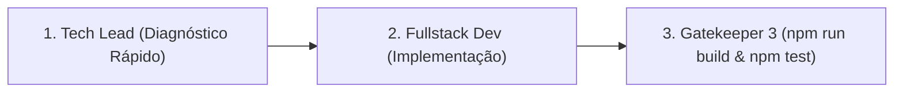

# ⚡ ESTEIRA 1: FAST-TRACK (Hotfixes, UI & Bugs Pontuais)

## 🎯 Aplicabilidade
Esta esteira é ativada para tarefas de **baixo risco**, tais como:
- Ajustes de layout, TailwindCSS, cores, alinhamentos e responsividade.
- Alterações em textos, microcopies de formulários e banners.
- Correções de bugs simples em componentes React que não alterem schemas de banco Supabase, rotas financeiras ou Edge Functions.

---

## 🚀 Fluxo de Execução Enxuto (3 Passos)

### **Passo 1: Diagnóstico e Escopo (Tech Lead)**
- Verificar se a alteração realmente não afeta pagamentos, dados de saúde ou RLS.
- Definir os arquivos exatos a serem modificados.

### **Passo 2: Implementação Defensiva (Fullstack Dev)**
- Modificar o código garantindo tipagem TypeScript e alinhamento com TailwindCSS.

### **Passo 3: Verificação de Build e Testes (Gatekeeper 3)**
- Executar `npm run build` e `npm test` no terminal.
- Se os testes passarem sem erros, declarar a tarefa **CONCLUÍDA**.
