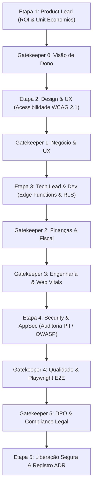

# 🛡️ ESTEIRA 3: FULL-TRACK (Pagamentos, RLS, Zoom, Fiscal & LGPD)

## 🎯 Aplicabilidade
Esta esteira é obrigatoriamente ativada para alterações de **alto risco**, tais como:
- Qualquer modificação no fluxo de checkout Mercado Pago (PIX inline, cartão direto, parcelamento).
- Alterações em Edge Functions Deno em `supabase/functions/` (webhooks, Zoom OAuth, disparo SMTP).
- Criação ou migração de tabelas/políticas RLS no Supabase.
- Tratamento de dados sensíveis de psicologia, prontuários ou normas CFP/LGPD/HIPAA.
- Emissão automatizada de Nota Fiscal Eletrônica (NFS-e) e conciliação de Ledger.

---

## 🚀 Fluxo Rigoroso de Execução (6 Etapas & 6 Gatekeepers)

---

## 📋 Checklist dos 6 Gatekeepers de Validação Cruzada

1. **Gatekeeper 0: Visão de Dono & Unit Economics**
   - Impacto na margem por consulta e sustentabilidade da infraestrutura validados.
2. **Gatekeeper 1: Negócio & UX**
   - Usabilidade sem atritos no checkout e linguagem empática.
3. **Gatekeeper 2: Finanças, Pagamentos & Fiscal**
   - Idempotência do webhook Mercado Pago e Ledger financeiro 100% conciliado.
4. **Gatekeeper 3: Engenharia & Performance**
   - TypeScript/Zod 100% tipado, sem degradação nos Core Web Vitals (LCP < 2.5s).
5. **Gatekeeper 4: Qualidade & Segurança**
   - Execução bem-sucedida da suíte E2E Playwright e RLS ativo no Supabase.
6. **Gatekeeper 5: Governança & LGPD**
   - Zero vazamento de PII em logs e consentimento do paciente auditado.
