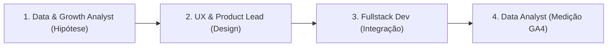

# 📈 ESTEIRA 5: GROWTH & EXPERIMENT (SEO, Mkt & A/B Tests)

## 🎯 Aplicabilidade
Esta esteira é ativada para tarefas estritamente comerciais e focadas em crescimento de funil (Aquisição, Retenção, SEO e CRO), tais como:
- Criação e análise de testes A/B em landing pages.
- Otimização de Meta Tags, H1, e marcações Schema.org para SEO Clínico.
- Ajustes de réguas de comunicação via E-mail/WhatsApp para redução de *no-show*.
- Setup de rastreamento de novos eventos personalizados no Google Analytics 4 (GA4).
- Desenvolvimento de fluxos B2B ou Quiz de Triagem para captação de leads (Inbound).

---

## 🚀 Fluxo Orientado a Dados (4 Passos)

### **Passo 1: Hipótese Baseada em Dados (Data & Growth Analyst)**
- Avaliar os dados/relatórios fornecidos pelo usuário.
- Formular a hipótese estruturada (Ex: "Reduzir o formulário de 5 para 3 campos aumentará a conversão de checkout em 10%").

### **Passo 2: Design e Copys (Product Lead & UX)**
- Elaborar *microcopy* empática e alinhada ao tom da Doxologos.
- Projetar o experimento com o menor atrito possível (Tailwind/Radix UI).

### **Passo 3: Implementação Tecnológica (Fullstack Dev)**
- Codificar as landing pages, banners ou eventos. Garantir que os disparos de `gtag` (GA4) ou chamadas à API estejam corretos e sem bloqueios (ex: bloqueadores de anúncios).

### **Passo 4: Preparação para Medição (Data Analyst)**
- Validar se o experimento tem uma métrica chave definida. Acompanhar a coleta dos dados para garantir significância estatística após o deploy.
