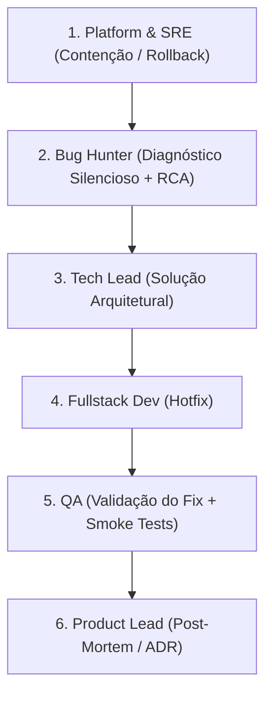

# 🚨 ESTEIRA 4: INCIDENT RESPONSE (Hotfix & Crises em Produção)

## 🎯 Aplicabilidade
Esta esteira é ativada em **Emergências e Incidentes de Produção** (Ex: PagerDuty). Casos de uso:
- Checkout Mercado Pago fora do ar, gerando erros de pagamento.
- Falha na emissão de salas Zoom ou disparo de E-mails transacionais (pacientes não recebem link).
- Queda geral de disponibilidade, vazamento de PII ou violação de RLS.
- Bugs graves introduzidos na última release.

---

## 🚀 Fluxo de Sobrevivência (Contenção e Resolução)

### **Passo 1: Contenção de Danos (Platform & Security)**
- *Ação Imediata:* Desativar a feature afetada via Feature Flag ou preparar o rollback de versão sem alterar código impulsivamente.
- O objetivo número 1 é estancar a perda financeira e de dados.

### **Passo 2: Diagnóstico Silencioso (Bug Hunter)**
- *Regra de Ouro:* **Não adivinhar. Não propor código antes da Root Cause.** O Bug Hunter executa o protocolo de triage por camada (Frontend / Edge Function / Banco / Integração).
- Coletar: logs do Supabase Dashboard, stack trace, status codes HTTP, último deploy relacionado.
- Entregar handoff estruturado ao Tech Lead: Camada afetada + Root Cause confirmada + Arquivos afetados + Impacto.

### **Passo 3: Solução Arquitetural (Tech Lead)**
- Após receber o handoff do Bug Hunter, propor a solução mínima e compatível. Consultar `ARCH.md` para garantir consistência.

### **Passo 4: Desenvolvimento do Hotfix (Fullstack Dev)**
- Escrever o patch de correção focando exclusivamente em resolver a falha. Proibido introduzir novas features ou refatorações maiores neste momento (manter o pull request mínimo).

### **Passo 5: Validação Rigorosa (QA)**
- Executar `npm run squad:check` e garantir que o hotfix corrige o bug sem quebrar dependências (100% Backward Compatible).
- Executar smoke tests nos fluxos críticos impactados (PIX / Zoom / Email conforme aplicável).

### **Passo 6: Blameless Post-Mortem (Product Lead)**
- Documentar em `03_SQUAD_MEMORY.md` **Seção 6 (Bugs Conhecidos)**: Qual foi o impacto? Root Cause confirmada? Como resolvemos? Como garantimos (testes/alarmes) que nunca mais vai acontecer?
