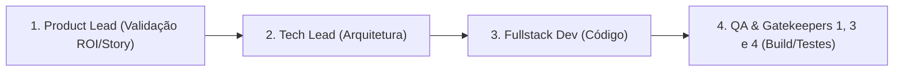

# 📦 ESTEIRA 2: STANDARD-TRACK (Features Médias & Componentes)

## 🎯 Aplicabilidade
Esta esteira é ativada para funcionalidades de **médio porte**, tais como:
- Criação de novas telas ou modais na Área do Paciente/Admin.
- Criação de novas consultas ou hooks de dados no Supabase.
- Novos componentes do Design System (Radix UI / shadcn).
- Validações de novos formulários com Zod.

---

## 🚀 Fluxo de Execução (4 Passos)

### **Passo 1: Validação de Requisitos (Product Lead)**
- Confirmar critérios de aceite e linguagem humanizada no frontend.

### **Passo 2: Arquitetura & Contratos (Tech Lead)**
- Definir tipagens, hooks TanStack Query e estruturas de dados.

### **Passo 3: Construção da Feature (Fullstack Dev)**
- Implementar os componentes React e conectar com o banco Supabase.

### **Passo 4: Qualidade & Validação (QA & Gatekeepers)**
- Executar a suíte de testes unitários (`npm test`) e compilação (`npm run build`).
- Registrar qualquer decisão relevante em `03_SQUAD_MEMORY.md`.
