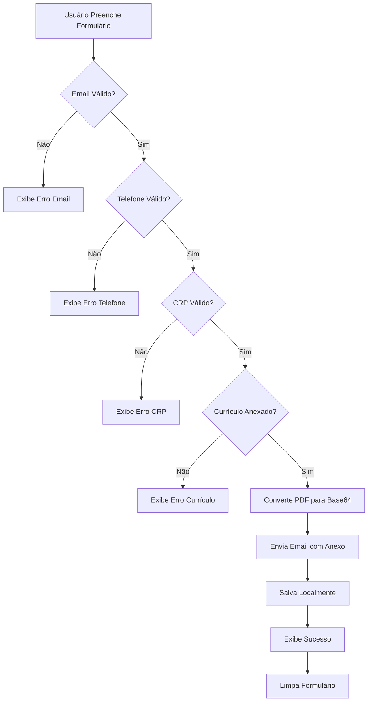

# 📋 Validações do Formulário "Trabalhe Conosco"

**Data:** 28/10/2025  
**Arquivo:** `src/pages/TrabalheConoscoPage.jsx`

## ✅ Implementações

### 1. **Máscara de Telefone**
- **Formato:** `(11) 98765-4321` (celular) ou `(11) 3456-7890` (fixo)
- **Validação:** Mínimo 10 dígitos (DDD + número)
- **Função:** `formatPhone(value)`
- **Comportamento:**
  - Remove caracteres não numéricos
  - Aplica formatação automática durante digitação
  - Aceita telefone fixo (10 dígitos) ou celular (11 dígitos)

```javascript
// Exemplos válidos:
(11) 3456-7890  // Telefone fixo
(11) 98765-4321 // Celular
```

---

### 2. **Máscara de CRP**
- **Formato:** `06/123456` (UF + número)
- **Validação:** Mínimo 8 dígitos no total
- **Função:** `formatCRP(value)`
- **Comportamento:**
  - Remove caracteres não numéricos
  - Aplica formatação `XX/XXXXXX` automaticamente
  - Limite de 9 caracteres (incluindo a barra)

```javascript
// Exemplo válido:
06/123456  // CRP de São Paulo
```

---

### 3. **Validação de Email**
- **Formato:** Padrão RFC 5322 simplificado
- **Validação em tempo real:** Feedback visual ao digitar
- **Função:** `validateEmail(email)`
- **Comportamento:**
  - Valida formato `usuario@dominio.com`
  - Exibe mensagem de erro abaixo do campo
  - Borda vermelha se inválido
  - Bloqueia envio se email estiver inválido

```javascript
// Regex utilizado:
/^[^\s@]+@[^\s@]+\.[^\s@]+$/
```

---

## 🔍 Validações no Submit

Antes de enviar o formulário, o sistema valida:

### **1. Email Válido**
```javascript
if (!validateEmail(formData.email)) {
  // Toast de erro: "Email inválido"
  return;
}
```

### **2. Telefone Completo**
```javascript
const phoneDigits = formData.phone.replace(/\D/g, '');
if (phoneDigits.length < 10) {
  // Toast de erro: "Telefone inválido"
  return;
}
```

### **3. CRP Completo**
```javascript
const crpDigits = formData.crp.replace(/\D/g, '');
if (crpDigits.length < 8) {
  // Toast de erro: "CRP inválido"
  return;
}
```

---

## 🎨 Feedback Visual

### **Email:**
- ✅ **Válido:** Borda verde (padrão focus)
- ❌ **Inválido:** Borda vermelha + mensagem de erro abaixo

### **Telefone:**
- Placeholder: `(11) 98765-4321`
- MaxLength: 15 caracteres

### **CRP:**
- Placeholder: `Ex: 06/123456`
- MaxLength: 9 caracteres

---

## 📝 Campos Obrigatórios

Todos os campos abaixo são obrigatórios (atributo `required`):

1. ✓ Nome Completo
2. ✓ Email
3. ✓ Telefone
4. ✓ CRP
5. ✓ Especialidade
6. ✓ Tempo de Experiência
7. ✓ Currículo (PDF)

**Opcional:**
- Mensagem / Carta de Apresentação

---

## 🚀 Testes Recomendados

### **Telefone:**
```
✅ (11) 98765-4321  → Válido (celular)
✅ (11) 3456-7890   → Válido (fixo)
❌ (11) 9876       → Inválido (incompleto)
❌ 987654321       → Inválido (sem DDD)
```

### **CRP:**
```
✅ 06/123456  → Válido
✅ 15/987654  → Válido
❌ 06/123     → Inválido (incompleto)
❌ 123456     → Inválido (sem UF)
```

### **Email:**
```
✅ usuario@exemplo.com     → Válido
✅ nome.sobrenome@site.br  → Válido
❌ usuario@                → Inválido
❌ @exemplo.com            → Inválido
❌ usuario.exemplo.com     → Inválido (sem @)
```

---

## 📊 Fluxo de Validação



---

## 🛠️ Tecnologias Utilizadas

- **React Hooks:** `useState` para gerenciar estado do formulário
- **Regex:** Validação de email
- **String manipulation:** Formatação de telefone e CRP
- **Toast Notifications:** Feedback de erros
- **Visual Feedback:** Classes CSS condicionais

---

## 📁 Estrutura do Código

```javascript
const TrabalheConoscoPage = () => {
  // Estados
  const [formData, setFormData] = useState({...});
  const [emailError, setEmailError] = useState('');
  
  // Funções de formatação
  const formatPhone = (value) => {...};
  const formatCRP = (value) => {...};
  
  // Validação
  const validateEmail = (email) => {...};
  
  // Handler unificado
  const handleInputChange = (e) => {
    // Aplica máscaras e validações
  };
  
  // Submit com validações
  const handleSubmit = async (e) => {
    // Valida todos os campos antes de enviar
  };
};
```

---

## 🎯 Benefícios

1. **UX Melhorada:** Feedback em tempo real
2. **Dados Consistentes:** Formatação padronizada
3. **Menos Erros:** Validações antes do envio
4. **Profissionalismo:** Interface polida e responsiva

---

## 📞 Suporte

Em caso de dúvidas ou problemas, consulte:
- **Arquivo:** `src/pages/TrabalheConoscoPage.jsx`
- **Logger:** Use `window.setLogLevel('DEBUG')` para debug
- **Email Service:** `src/lib/emailService.js`
