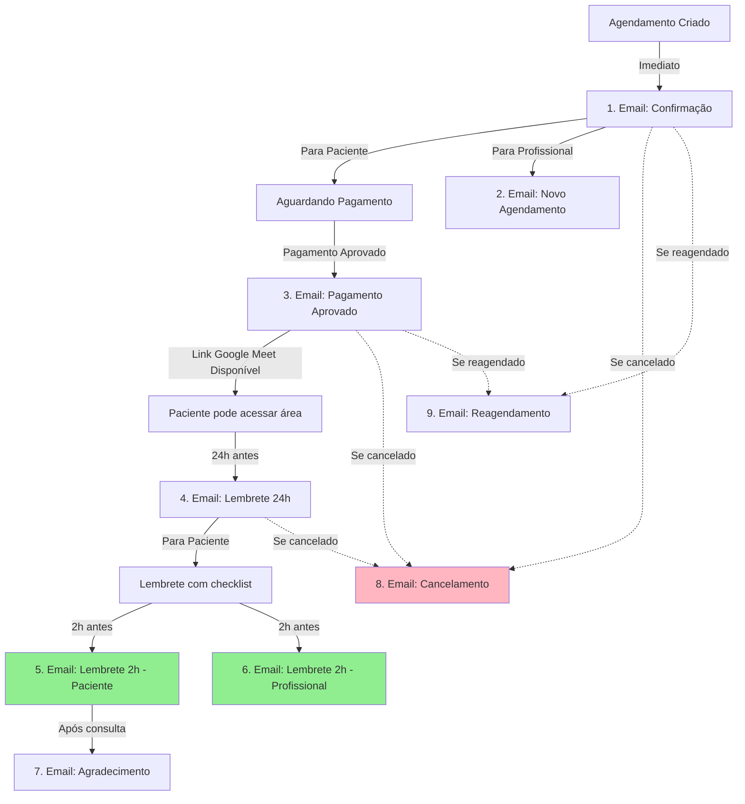

# 📧 Sistema de E-mails - Documentação Completa

> **Status**: ✅ Implementado e Atualizado (Dezembro 2025)  
> **Provider**: SMTP Hostinger  
> **Plataforma**: Google Meet (atualizado de Zoom)

---

## 📋 Índice

1. [Visão Geral](#visão-geral)
2. [Fluxo Completo de Emails](#fluxo-completo-de-emails)
3. [Templates e Regras](#templates-e-regras)
4. [Configuração](#configuração)
5. [Arquitetura](#arquitetura)
6. [Troubleshooting](#troubleshooting)

---

## 🎯 Visão Geral

Sistema completo de notificações por email para o fluxo de agendamento, incluindo:

- ✅ **7 templates principais** para pacientes
- ✅ **2 templates para profissionais**
- ✅ **Lembretes automatizados** (24h e 2h antes)
- ✅ **Emails transacionais** (confirmação, pagamento, cancelamento)
- ✅ **Integração com Google Meet**

### Tecnologias

- **SMTP**: Hostinger (smtp.hostinger.com:465)
- **Library**: Nodemailer
- **Backend**: Netlify Functions
- **Agendamento**: Netlify Scheduled Functions (nativo)
- **Templates**: HTML responsivo com CSS inline

---

## 🔄 Fluxo Completo de Emails

### Diagrama de Fluxo



### Timeline de Envio

| Momento | Email | Destinatário | Trigger |
|---------|-------|--------------|---------|
| **Imediato** | Confirmação de Agendamento | Paciente | Criação do agendamento |
| **Imediato** | Novo Agendamento | Profissional | Criação do agendamento |
| **Após pagamento** | Pagamento Aprovado | Paciente | Webhook Mercado Pago |
| **24h antes** | Lembrete 24h | Paciente | Cron job automático |
| **2h antes** ⭐ | Lembrete 2h | Paciente | Cron job automático (novo) |
| **2h antes** ⭐ | Lembrete 2h | Profissional | Cron job automático (novo) |
| **Após consulta** | Agradecimento | Paciente | Status = completed |
| **Quando ocorre** | Cancelamento | Paciente | Status = cancelled |
| **Quando ocorre** | Reagendamento | Paciente | Data/hora alterada |

---

## 📬 Templates e Regras

### 1. Confirmação de Agendamento

**Arquivo:** `emailTemplates.js` → `bookingConfirmation()`

**Quando é enviado:**
- ✅ Imediatamente após criar agendamento
- ✅ Status: `pending_payment`

**Conteúdo:**
- Dados do agendamento (data, hora, profissional, serviço)
- Link para área do paciente
- Informação: "Link do Google Meet aparecerá após pagamento"
- Funciona direto no navegador, sem instalações

**Trigger:**
```javascript
await bookingEmailManager.sendConfirmation(bookingData);
```

**Regras:**
- Enviado apenas uma vez
- Não reenvia se já foi enviado
- Inclui informações de contato

---

### 2. Novo Agendamento (Para Profissional)

**Arquivo:** `emailTemplates.js` → `newBookingForProfessional()`

**Quando é enviado:**
- ✅ Imediatamente após criar agendamento
- ✅ Notifica o profissional sobre novo paciente

**Conteúdo:**
- Dados completos do paciente
- Informações da consulta
- Plataforma: Google Meet
- Link da reunião (se já disponível)

**Trigger:**
```javascript
await bookingEmailManager.sendNewBookingForProfessional(bookingData);
```

---

### 3. Pagamento Aprovado

**Arquivo:** `emailTemplates.js` → `paymentApproved()`

**Quando é enviado:**
- ✅ Após confirmação de pagamento (Mercado Pago webhook)
- ✅ Status muda para: `confirmed` ou `paid`

**Conteúdo:**
- Confirmação de pagamento
- **Link do Google Meet** (destaque)
- Instruções simplificadas (6 passos)
- Dica: "Não precisa instalar nada!"
- Checklist de preparação

**Trigger:**
```javascript
await bookingEmailManager.sendPaymentApproved(bookingData);
```

**Instruções Google Meet:**
1. Acesse sua área do paciente
2. Google Meet abrirá direto no navegador
3. Clique em "Pedir para participar"
4. Digite seu nome
5. Aguarde na sala de espera
6. Permita acesso à câmera e microfone

---

### 4. Lembrete 24h Antes

**Arquivo:** `emailTemplates.js` → `bookingReminder()`

**Quando é enviado:**
- ✅ Automaticamente 24 horas antes da consulta
- ✅ Via cron job (implementação manual necessária)

**Conteúdo:**
- Lembrete amigável
- Dados da consulta
- Link para área do paciente
- Link do Google Meet
- Checklist de preparação

**Trigger:**
```javascript
await bookingEmailManager.sendReminder(bookingData);
```

**Checklist:**
- ✓ Local tranquilo e privado
- ✓ Boa iluminação
- ✓ Fones de ouvido
- ✓ Conexão estável
- ✓ Câmera e microfone funcionando

---

### 5. Lembrete 2h Antes - Paciente ⭐ NOVO

**Arquivo:** `emailTemplates.js` → `bookingReminder2Hours()`

**Quando é enviado:**
- ✅ Automaticamente 2 horas antes da consulta
- ✅ Via Netlify Scheduled Function (a cada 15 minutos)
- ✅ Apenas se `reminder_2h_patient_sent = false`

**Conteúdo:**
- Tom urgente mas acolhedor
- **Link direto para Google Meet** (botão grande)
- Checklist rápido (6 itens)
- **Suporte em destaque** (WhatsApp + Email)
- Recomendação: entrar 5 minutos antes

**Trigger:**
```javascript
// Automático via functions/send-2h-reminders/index.js
await bookingEmailManager.sendReminder2Hours(bookingData);
```

**Lógica de Envio:**
```javascript
// Busca consultas entre 2h e 2h15min do horário atual
const now = new Date();
const twoHoursLater = new Date(now.getTime() + 2 * 60 * 60 * 1000);
const twoHours15Later = new Date(now.getTime() + 2.25 * 60 * 60 * 1000);

// Filtros
.eq('status', 'confirmed')
.eq('booking_date', currentDate)
.gte('booking_time', startTime)
.lte('booking_time', endTime)
.or('reminder_2h_sent.is.null,reminder_2h_sent.eq.false')
```

**Banco de Dados:**
- Coluna: `reminder_2h_patient_sent` (boolean)
- Atualizada após envio bem-sucedido
- Previne envios duplicados

---

### 6. Lembrete 2h Antes - Profissional ⭐ NOVO

**Arquivo:** `emailTemplates.js` → `professionalReminder2Hours()`

**Quando é enviado:**
- ✅ Automaticamente 2 horas antes da consulta
- ✅ Via Netlify Scheduled Function (a cada 15 minutos)
- ✅ Apenas se `reminder_2h_professional_sent = false`

**Conteúdo:**
- Dados completos do paciente
- Link direto para Google Meet
- Dicas profissionais de preparação
- Nota: "Paciente também foi notificado"

**Trigger:**
```javascript
// Automático via functions/send-2h-reminders/index.js
await bookingEmailManager.sendProfessionalReminder2Hours(bookingData);
```

**Banco de Dados:**
- Coluna: `reminder_2h_professional_sent` (boolean)
- Coluna: `reminder_2h_sent` (boolean) - marcada quando ambos enviados
- Coluna: `reminder_2h_sent_at` (timestamp) - quando foi enviado

---

### 7. Agradecimento Pós-Consulta

**Arquivo:** `emailTemplates.js` → `bookingThankYou()`

**Quando é enviado:**
- ✅ Após conclusão do atendimento
- ✅ Status muda para: `completed`

**Conteúdo:**
- Mensagem de agradecimento
- Link para avaliação
- Incentivo para novo agendamento

**Trigger:**
```javascript
await bookingEmailManager.sendThankYou(bookingData);
```

---

### 8. Cancelamento

**Arquivo:** `emailTemplates.js` → `bookingCancellation()`

**Quando é enviado:**
- ✅ Status muda para qualquer `cancelled_*`
- ✅ Status muda para `no_show_unjustified`

**Situações de Envio:**

#### Situação 1: Edição de Agendamento
```javascript
// AdminPage.jsx linha 1310
if (statusChanged && (status.includes('cancelled') || status === 'no_show_unjustified')) {
    const reason = status === 'no_show_unjustified' 
        ? 'Consulta marcada como falta injustificada (sem reembolso)'
        : isAdminView 
            ? 'Cancelado pela administração'
            : 'Cancelado pelo profissional';
    
    await bookingEmailManager.sendCancellation(emailData, reason);
}
```

#### Situação 2: Mudança Rápida de Status
```javascript
// AdminPage.jsx linha 1434-1437
if (newStatus === 'no_show_unjustified') {
    await bookingEmailManager.sendCancellation(emailData, 
        'Consulta marcada como falta injustificada (sem reembolso)');
} else if (newStatus.includes('cancelled')) {
    const reason = isAdminUser 
        ? 'Cancelado pela administração' 
        : 'Cancelado pelo profissional';
    await bookingEmailManager.sendCancellation(emailData, reason);
}
```

**Conteúdo:**
- Dados do agendamento cancelado
- Motivo do cancelamento
- Informações de reembolso (se aplicável)
- Botão para novo agendamento

**Motivos possíveis:**
- "Cancelado pela administração"
- "Cancelado pelo profissional"
- "Cancelado pelo paciente"
- "Falta injustificada (sem reembolso)"

---

### 9. Reagendamento

**Arquivo:** `emailTemplates.js` → `bookingRescheduled()`

**Quando é enviado:**
- ✅ Data ou hora do agendamento é alterada
- ✅ Status não está cancelado

**Conteúdo:**
- Data antiga vs nova data
- Motivo do reagendamento
- Link para visualizar

**Trigger:**
```javascript
await bookingEmailManager.sendRescheduled(
    newBookingData, 
    oldDate, 
    oldTime, 
    reason
);
```

---

## ⚙️ Configuração

### Variáveis de Ambiente (Netlify)

```bash
# Supabase
VITE_SUPABASE_URL=https://seu-projeto.supabase.co
SUPABASE_SERVICE_ROLE_KEY=sua-service-role-key

# SMTP Hostinger
SMTP_HOST=smtp.hostinger.com
SMTP_PORT=465
SMTP_USER=doxologos@doxologos.com.br
SMTP_PASS=sua-senha-smtp
SMTP_FROM_NAME=Doxologos Psicologia
SMTP_FROM_EMAIL=doxologos@doxologos.com.br
```

### Configuração de Scheduled Functions

**Arquivo:** `functions/send-2h-reminders/index.js`

```javascript
// Configuração nativa do Netlify
export const config = {
  schedule: "*/15 * * * *"  // A cada 15 minutos
};
```

**Netlify detecta automaticamente** e agenda a execução!

---

## 🏗️ Arquitetura

### Estrutura de Arquivos

```
src/lib/
├── emailService.js          # Core service (fetch para Netlify)
├── emailTemplates.js        # 9 templates HTML
└── bookingEmailManager.js   # 9 métodos de envio

functions/
├── send-email/              # Função de envio via SMTP
│   └── index.js
└── send-2h-reminders/       # Função scheduled (novo)
    ├── index.js
    └── package.json
```

### Fluxo de Envio

```
┌──────────────────┐
│   Frontend       │
│ (React/Admin)    │
└────────┬─────────┘
         │
         │ bookingEmailManager.sendConfirmation()
         ▼
┌──────────────────┐
│ bookingEmail     │
│   Manager        │────► Formata dados + template
└────────┬─────────┘
         │
         │ emailService.send({ to, subject, html })
         ▼
┌──────────────────┐
│  emailService    │────► POST /.netlify/functions/send-email
└────────┬─────────┘
         │
         ▼
┌──────────────────┐
│ Netlify Function │────► nodemailer.sendMail()
│   send-email     │
└────────┬─────────┘
         │
         ▼
┌──────────────────┐
│  SMTP Hostinger  │────► smtp.hostinger.com:465
└────────┬─────────┘
         │
         ▼
┌──────────────────┐
│  Destinatário    │
└──────────────────┘
```

### Fluxo de Lembretes Automáticos

```
┌──────────────────┐
│ Netlify Cron     │────► Executa a cada 15 minutos
│  (Scheduled)     │
└────────┬─────────┘
         │
         ▼
┌──────────────────┐
│ send-2h-reminders│────► Busca consultas (2h a 2h15min)
│   Function       │
└────────┬─────────┘
         │
         ▼
┌──────────────────┐
│   Supabase DB    │────► SELECT bookings WHERE...
└────────┬─────────┘
         │
         ▼
┌──────────────────┐
│ Para cada booking│────► Envia 2 emails:
│                  │       1. Paciente
│                  │       2. Profissional
└────────┬─────────┘
         │
         ▼
┌──────────────────┐
│ Atualiza flags   │────► reminder_2h_sent = true
│   no banco       │
└──────────────────┘
```

---

## 📊 Regras de Negócio

### Quando NÃO enviar emails

❌ **Não enviar se:**
- Email já foi enviado (verificar flags no banco)
- Status do agendamento é `cancelled`
- Email do destinatário está vazio
- Agendamento está no passado (para lembretes)

### Flags de Controle (Banco de Dados)

```sql
-- Tabela: bookings
reminder_24h_sent BOOLEAN DEFAULT false
reminder_2h_sent BOOLEAN DEFAULT false
reminder_2h_patient_sent BOOLEAN DEFAULT false
reminder_2h_professional_sent BOOLEAN DEFAULT false
reminder_2h_sent_at TIMESTAMP
```

### Prioridade de Envio

1. **Alta**: Confirmação, Pagamento Aprovado, Cancelamento
2. **Média**: Lembretes 2h antes
3. **Baixa**: Lembretes 24h antes, Agradecimento

---

## 🔧 Troubleshooting

### Emails não estão sendo enviados

**Verificar:**
1. Variáveis de ambiente no Netlify
2. Logs da função: Netlify → Functions → send-email
3. Status do agendamento (`confirmed`?)
4. Email do destinatário válido?

**Comando de teste:**
```bash
curl -X POST https://seu-site.netlify.app/.netlify/functions/send-email \
  -H "Content-Type: application/json" \
  -d '{"to":"teste@email.com","subject":"Teste","html":"<h1>Teste</h1>"}'
```

### Lembretes 2h não funcionam

**Verificar:**
1. Função `send-2h-reminders` está ativa no Netlify?
2. Ícone ⏰ aparece ao lado da função?
3. Logs da função (última execução)
4. Consulta tem `status = 'confirmed'`?
5. Horário da consulta está correto?

**Query de teste:**
```sql
SELECT * FROM bookings 
WHERE status = 'confirmed' 
  AND booking_date = CURRENT_DATE
  AND booking_time BETWEEN (CURRENT_TIME + INTERVAL '1h 45m') 
                       AND (CURRENT_TIME + INTERVAL '2h 15m');
```

### Email vai para SPAM

**Soluções:**
1. Configurar SPF/DKIM no Hostinger
2. Usar domínio verificado
3. Evitar palavras como "grátis", "promoção"
4. Incluir link de descadastramento

---

## 📚 Referências

- [Nodemailer Documentation](https://nodemailer.com/)
- [Netlify Scheduled Functions](https://docs.netlify.com/functions/scheduled-functions/)
- [Hostinger SMTP Settings](https://support.hostinger.com/en/articles/1583218)
- [HTML Email Best Practices](https://www.campaignmonitor.com/css/)

---

**Última atualização**: 17/12/2025 | Versão 2.0 (Google Meet + Lembretes 2h)
