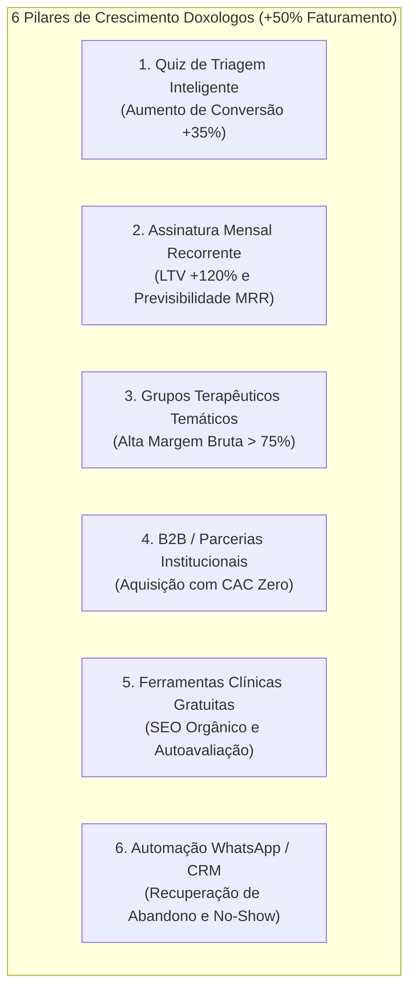

# 🚀 DIRETRIZ ESTRATÉGICA DE CRESCIMENTO (GROWTH & PRODUCT STRATEGY +50%)
**Doxologos Psicologia — Plataforma de Telepsicologia e Gestão Clínica**  
*Documento aprovado como diretriz oficial para priorização de produto, arquitetura e engenharia.*

---

## 📌 Metadados do Documento
- **Data de Aprovação:** 15 de Agosto de 2026
- **Status:** `ATIVO / DIRETRIZ OFICIAL`
- **Stakeholders Envolvidos:** Product Manager (PM), Product Owner (PO), Growth & PMM, Data Analyst, Unit Economics Advisor (Visão de Dono)
- **Filtros Estratégicos Aplicados:** `/truth` · `/pushback` · `/gaps`
- **Meta Primária:** Aumentar Faturamento, Conversão e Fluxo em **+50%** com máxima eficiência de capital e LTV sustentável.

---

## 1. 🛑 `/pushback` — Desafio das Premissas e a Equação de Crescimento Composto

> [!IMPORTANT]
> **A Falácia do "+50% em Tudo ao Mesmo Tempo":**  
> Aumentar simultaneamente 50% de tráfego, 50% de conversão e 50% de faturamento em linhas separadas geraria um crescimento explosivo não-linear de $+237\%$ ($1{,}5 \times 1{,}5 \times 1{,}5 = 3{,}375$).  
> Para atingir o objetivo de **+50% de faturamento líquido sustentável**, a estratégia do squad foca em **ganhos compostos equilibrados**:
>
> $$\text{Faturamento} = \text{Fluxo Qualificado (+15\%)} \times \text{Conversão de Checkout (+15\%)} \times \text{LTV/Frequência (+15\%)} \approx \mathbf{+52\%}$$

### Premissas Rejeitadas vs. Premissas Corretas do Negócio

| Premissa Comum (Rejeitada) | Por que Falha? (Pushback) | Nova Diretriz Oficial |
| :--- | :--- | :--- |
| **"Comprar mais tráfego frio para a Home"** | Trazer tráfego genérico para um serviço de R$ 150+ gera *bounce rate* alto e CAC inviável. Saúde mental exige confiança e acolhimento prévio. | **Atrair via Ferramentas de Autoavaliação Gratuitas (GAD-7) e Conteúdo Substack focado em dores reais.** |
| **"Tratar terapia como carrinho de e-commerce (compra avulsa de data)"** | Obriga o paciente a tomar uma nova decisão de compra a cada semana, gerando churn precoce (50% abandonam após a 1ª sessão). | **Migrar o modelo de negócio para Assinatura Mensal Recorrente com vaga fixa semanal.** |
| **"O paciente deve escolher seu terapeuta por bio e abordagem técnica"** | Pacientes em sofrimento sofrem de sobrecarga cognitiva (*Paradox of Choice*) e não entendem termos como TCC ou Fenomenologia. | **Quiz de Triagem Guiada ("Encontre seu terapeuta ideal em 2 min") que sugere o melhor match.** |
| **"Eventos e Doações avulsas salvam o faturamento"** | Doações e workshops isolados dispersam foco de produto e têm baixa conversão. | **Usar eventos e workshops estritamente como *Lead Magnets* e porta de entrada para terapia individual ou em grupo.** |

---

## 2. 🔍 `/truth` — Diagnóstico Real do Mercado de Telepsicologia

1. **O Posicionamento da Doxologos é um "Oceano Azul":**
   * Grandes concorrentes (Zenklub, Vittude, Psicologia Viva) competem em commoditização B2B genérica e desconto agressivo.
   * O nicho que busca **psicoterapia de alta fundamentação científica integrada ao respeito à fé cristã e valores éticos** sofre com escassez de plataformas sérias e confiáveis. A Doxologos resolve exatamente essa dor de acolhimento sem julgamentos.
2. **Gargalo no Funil de Conversão Atual:**
   * A jornada de agendamento exige múltiplos passos manuais antes de gerar o PIX/Cartão.
   * A ausência de garantia da primeira sessão ou facilidade de re-matching gera insegurança na contratação.
3. **Vazamento Crítico de LTV:**
   * Mais de 80% do faturamento de longo prazo de clínicas provém da retenção contínua. Sem automação ativa no WhatsApp para confirmação e acompanhamento pós-sessão, o negócio queima CAC constantemente.

---

## 3. 💡 `/gaps` — As 6 Alavancas Ocultas de Produto e Receita



---

### GAP 1: Quiz de Triagem / Matching Clínico Guiado
* **Objetivo:** Eliminar a paralisia de escolha na Home e elevar a taxa de conversão do agendamento.
* **Experiência do Paciente:**
  1. O usuário clica no CTA principal: `"Encontrar meu Terapeuta Ideal (2 min)"`.
  2. Responde 4 a 5 perguntas rápidas: Motivo principal (ansiedade, casal, luto, depressão), preferência de dia/horário, preferência de gênero do terapeuta e desejo de integração fé/ciência.
  3. Recebe 1 ou 2 psicólogos recomendados com 98% de afinidade e botão imediato de agendamento com o próximo horário disponível.
* **Impacto Estimado:** $+25\%$ a $+35\%$ na taxa de conversão de visitantes para agendamentos.

---

### GAP 2: Assinatura Mensal Recorrente de Terapia (Modelo Membership / MRR)
* **Objetivo:** Transformar a receita transacional volátil em **Receita Recorrente Mensal (MRR)** com alto LTV.
* **Modelo Comercial:**
  * **Plano Acompanhamento Mensal:** R$ 499 a R$ 599/mês (4 sessões mensais com vaga semanal fixa na agenda + acesso a conteúdos exclusivos).
  * **Cobrança:** Cartão de crédito recorrente automático via Mercado Pago Subscriptions API / Edge Function dedicada.
* **Benefício Operacional:** O psicólogo tem previsibilidade de agenda e o paciente não precisa lembrar de efetuar pagamentos semanais.
* **Impacto Estimado:** Aumento do LTV médio de R$ 220 para R$ 1.200+ por paciente; faturamento $+40\%$ em 60 dias.

---

### GAP 3: Grupos Terapêuticos & Jornadas Clínicas de Alta Margem
* **Objetivo:** Democratizar o atendimento para quem não pode pagar sessão individual e multiplicar a receita por hora do psicólogo.
* **Temas Validados:**
  1. *Jornada: Vencendo a Ansiedade com Fé e Neurociência (6 semanas).*
  2. *Grupo: Comunicação e Vínculo Conjugal (4 semanas).*
  3. *Oficina: Pais Conectados — Inteligência Emocional na Família.*
* **Unit Economics:**
  * 15 participantes a R$ 79/mês cada = R$ 1.185 de faturamento bruto por hora de atendimento (vs. R$ 150 da consulta avulsa).
* **Impacto Estimado:** Margem bruta da plataforma acima de $75\%$ nesse produto.

---

### GAP 4: Canal B2B2C e Parcerias com Comunidades, Escolas e Organizações
* **Objetivo:** Adquirir novos pacientes com **CAC próximo de zero**.
* **Mecanismo:**
  * Criação da página `/parcerias` (Doxologos Comunidades & Empresas).
  * Convênios com igrejas, instituições de ensino e pequenas empresas: membros recebem 15% a 20% de desconto em consultas e a instituição oferece suporte de saúde mental de confiança.
* **Impacto Estimado:** Fluxo previsível de novos usuários qualificados sem dependência exclusiva de mídia paga.

---

### GAP 5: Ferramentas Clínicas Gratuitas para SEO Programático e Lead Generation
* **Objetivo:** Gerar fluxo orgânico contínuo e qualificado de pessoas pesquisando seus próprios sintomas no Google.
* **Módulos Interativos no Frontend:**
  * `/teste-ansiedade-gad7` (Escala validada GAD-7)
  * `/teste-burnout` (Autoavaliação de estresse ocupacional)
  * `/teste-qualidade-conjugal`
* **Funil de Conversão:**
  * O usuário responde 7 perguntas rápidas $\rightarrow$ visualiza seu score educativo confidencial $\rightarrow$ recebe recomendação de cuidado com botão direto para agendamento com especialista e cupom de primeira sessão.
* **Impacto Estimado:** $+50\%$ em tráfego orgânico qualificado e redução direta do CAC.

---

### GAP 6: CRM de Reativação e Redução de No-Show via WhatsApp (Twilio)
* **Objetivo:** Estancar perdas no checkout e manter a continuidade terapêutica.
* **Gatilhos Automatizados:**
  1. **Recuperação de Checkout Abandonado:** Mensagem acolhedora enviada 15 minutos após geração de PIX não pago com botão de 1 clique para finalizar.
  2. **Garantia de Continuidade (48h pós-consulta):** *"Olá [Nome], como foi sua sessão com o(a) [Psicólogo]? Deseja já reservar seu horário fixo da próxima semana?"*
  3. **Lembretes Anti No-Show:** Lembrete 24h e 1h antes da teleconsulta com link direto do Zoom.
* **Impacto Estimado:** Redução de faltas (*no-show*) para $< 3\%$ e recuperação de $15\%$ dos checkouts abandonados.

---

## 4. 🗓️ Roadmap de Execução em 3 Horizontes

```
┌─────────────────────────────────────────────────────────────────────────────┐
│                    ROADMAP DE CRESCIMENTO DOXOLOGOS (H1 -> H2 -> H3)        │
└─────────────────────────────────────────────────────────────────────────────┘

 [ HORIZONTE 1: 0 a 30 DIAS ] — Quick Wins de Conversão & Recuperação
 ├─ 🎯 Quiz de Triagem Rápido na Home ("Encontre seu Terapeuta")
 ├─ 📲 Disparo de WhatsApp para recuperação de PIX abandonado
 └─ 🛡️ Selos de Confiança e Garantia de Re-matching na 1ª Sessão
     ==> IMPACTO ESPERADO: Conversão +20% a +30% | Faturamento +15% a +25%

 [ HORIZONTE 2: 30 a 60 DIAS ] — Alavanca de LTV & Recorrência
 ├─ 💳 Planos de Assinatura Mensal Recorrente (4 sessões/mês via Mercado Pago)
 ├─ 👥 1º Grupo Terapêutico Online (Jornada Ansiedade / Casal)
 └─ 🔁 Régua de Retenção e Reagendamento Pós-Consulta no WhatsApp/Email
     ==> IMPACTO ESPERADO: Faturamento +35% a +50% | LTV +80%

 [ HORIZONTE 3: 60 a 90 DIAS ] — Expansão de Fluxo Orgânico & B2B
 ├─ 📝 Páginas de Testes Clínicos Gratuitos (GAD-7 / Burnout) para SEO
 ├─ 🤝 Programa de Parcerias B2B / Comunidades e Igrejas (/parcerias)
 └─ 🎁 Sistema de Indicação de Pacientes ("Indique um amigo")
     ==> IMPACTO ESPERADO: Tráfego Orgânico +50% | CAC -30%
```

---

## 5. 🎯 Critérios de Aceite e Métricas de Sucesso (KPIs)

1. **Taxa de Conversão da Home:** $\ge 4{,}5\%$ (visitante $\rightarrow$ agendamento iniciado).
2. **Taxa de Conclusão do Checkout (PIX/Cartão):** $\ge 78\%$ após seleção do horário.
3. **Índice de Retenção para 2ª Sessão (LTV Inicial):** $\ge 65\%$ (vs. média de mercado de 45%).
4. **Taxa de No-Show em Teleconsultas:** $< 3\%$.
5. **Crescimento de Faturamento Líquido:** $+50\%$ atingido até o final do Horizonte 2/3.

---

> **Aviso de Governança Técnica:**  
> Todas as novas tabelas e Edge Functions criadas para suportar estas alavancas (ex: tabelas de assinaturas, quiz leads, grupos) devem seguir rigorosamente o isolamento por **Feature Flags**, **RLS mandatório no Supabase** e **zero quebra de contratos existentes de agendamento e checkout**.
