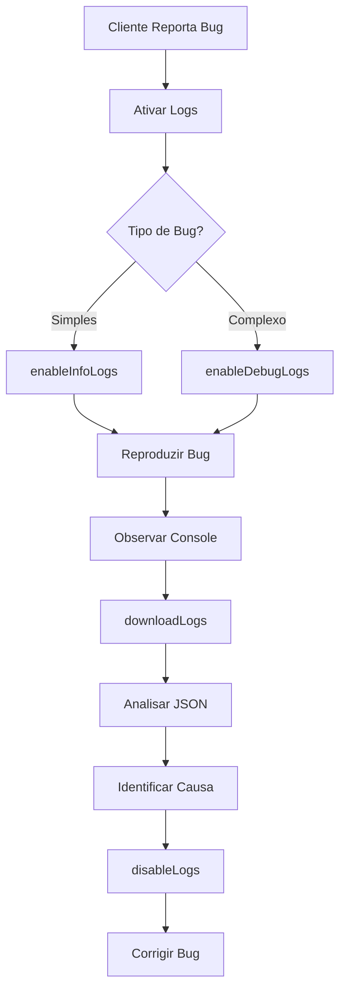

# Guia Rápido: Debug em Produção com Sistema de Logs

## 🚨 Cenário: Cliente Reporta Bug em Produção

### Passo 1: Ativar Logs Remotamente

**Opção A: Via Console (Mais Rápido)**
```javascript
// Abrir DevTools (F12) e executar:
window.enableInfoLogs();  // Para bugs comuns
// ou
window.enableDebugLogs(); // Para bugs complexos
```

**Opção B: Via localStorage (Persiste após reload)**
```javascript
localStorage.setItem('doxologos_log_level', 'DEBUG');
location.reload();
```

---

### Passo 2: Reproduzir o Problema

1. Peça ao cliente para reproduzir o bug
2. Observe os logs no console (F12)
3. Identifique o erro

---

### Passo 3: Capturar Logs

```javascript
// Ver logs no console
window.viewLogs();

// Baixar logs como JSON
window.downloadLogs();
```

Envie o arquivo `doxologos-logs-YYYY-MM-DD.json` para a equipe.

---

### Passo 4: Desativar Logs

**IMPORTANTE**: Sempre desative após debug para não impactar performance

```javascript
window.disableLogs();
```

---

## 🔍 Diagnóstico por Tipo de Problema

### Problema de Pagamento

```javascript
// Ativar INFO
window.enableInfoLogs();

// Reproduzir pagamento
// Procurar por logs:
// - ℹ️ [INFO] Payment initiated
// - ℹ️ [INFO] API POST /api/payments
// - ❌ [ERROR] Payment processing failed

// Capturar logs
window.downloadLogs();
```

---

### Problema de Login/Autenticação

```javascript
// Ativar INFO
window.enableInfoLogs();

// Tentar login
// Procurar por:
// - ℹ️ [INFO] Auth: Login successful
// - ❌ [ERROR] Erro na operação: login

window.downloadLogs();
```

---

### Problema de Performance

```javascript
// Ativar DEBUG (para ver timers)
window.enableDebugLogs();

// Reproduzir ação lenta
// Procurar por:
// - 🐛 [DEBUG] Performance: X = Yms

window.downloadLogs();
```

---

### Erro Intermitente

```javascript
// Ativar DEBUG e deixar rodando
window.enableDebugLogs();

// Aguardar erro acontecer naturalmente
// Logs ficam no buffer (últimos 100)

// Quando erro ocorrer:
window.downloadLogs();
```

---

## 📊 Analisar Arquivo de Logs

### Estrutura do JSON

```json
[
  {
    "timestamp": "2025-10-28T12:34:56.789Z",
    "level": "error",
    "message": "Payment processing failed",
    "data": {
      "message": "Network error",
      "stack": "Error: Network error\n    at ...",
      "method": "pix",
      "amount": 150
    },
    "userAgent": "Mozilla/5.0...",
    "url": "https://doxologos.com.br/checkout"
  }
]
```

### Filtrar por Tipo

```javascript
// Carregar logs.json
const logs = JSON.parse(fileContent);

// Apenas erros
const errors = logs.filter(log => log.level === 'error');

// Erros de pagamento
const paymentErrors = logs.filter(log => 
  log.level === 'error' && 
  log.message.includes('Payment')
);

// Últimos 10 logs
const recent = logs.slice(-10);
```

---

## ⚡ Comandos de Emergência

### Ver Estado Atual

```javascript
window.__DOXOLOGOS_LOGGER__.getInfo();
```

**Output**:
```javascript
{
  currentLevel: "SILENT",
  environment: "production",
  bufferSize: 23,
  commands: [...]
}
```

---

### Limpar Buffer (Liberar Memória)

```javascript
window.__DOXOLOGOS_LOGGER__.clearLogs();
```

---

### Mudar Nível Manualmente

```javascript
window.setLogLevel('ERROR');   // Apenas erros
window.setLogLevel('WARN');    // Erros + avisos
window.setLogLevel('INFO');    // Erros + avisos + infos
window.setLogLevel('DEBUG');   // Tudo
window.setLogLevel('SILENT');  // Nada
```

---

## 🎯 Checklist de Debug em Produção

- [ ] Ativar logs apropriados (`enableInfoLogs` ou `enableDebugLogs`)
- [ ] Reproduzir problema
- [ ] Verificar console (F12) para logs em tempo real
- [ ] Capturar logs (`window.downloadLogs()`)
- [ ] Analisar arquivo JSON
- [ ] **IMPORTANTE**: Desativar logs (`window.disableLogs()`)
- [ ] Limpar cache se necessário (`localStorage.clear()`)

---

## 🛡️ Segurança

### Dados Sensíveis São Redactados

```javascript
logger.info('User data', {
  name: 'João',
  password: '123456',  // ❌ Vira [REDACTED]
  email: 'joao@email.com'  // ✅ Aparece normal
});
```

**Palavras bloqueadas**: `password`, `token`, `key`, `secret`, `authorization`, `api_key`

---

## 📈 Impacto de Performance

| Nível | Overhead | Uso Recomendado |
|-------|----------|-----------------|
| SILENT | 0ms | Produção normal |
| ERROR | <1ms | Produção com problemas |
| WARN | <2ms | Investigação de avisos |
| INFO | <5ms | Debug ativo |
| DEBUG | <10ms | Debug complexo (temporário) |

**⚠️ Atenção**: Nunca deixe DEBUG ativo em produção por muito tempo!

---

## 🔄 Workflow Completo



---

## 💡 Dicas Pro

### 1. Monitorar em Tempo Real

```javascript
// Adicionar listener para logs em tempo real
window.__DOXOLOGOS_LOGGER__.addListener((logEntry) => {
  if (logEntry.level === 'error') {
    // Enviar para serviço de tracking (Sentry, LogRocket, etc)
    console.error('CRITICAL:', logEntry);
  }
});
```

---

### 2. Debug Específico de Módulo

```javascript
// Filtrar logs por categoria no console
const paymentLogs = window.viewLogs().filter(log => 
  log.message.includes('Payment')
);
console.table(paymentLogs);
```

---

### 3. Compartilhar Logs com Suporte

```javascript
// Gerar link compartilhável (se usar serviço de upload)
window.downloadLogs();
// Cliente envia arquivo via email ou ticket
```

---

## 📞 Suporte Técnico

Se precisar de ajuda:

1. **Ativar DEBUG**: `window.enableDebugLogs()`
2. **Reproduzir problema**
3. **Capturar logs**: `window.downloadLogs()`
4. **Enviar arquivo** para: suporte@doxologos.com.br
5. **Incluir**: 
   - URL da página
   - Passos para reproduzir
   - Navegador e versão
   - Screenshot do erro

---

**Última atualização**: 2025  
**Versão**: 2.0
