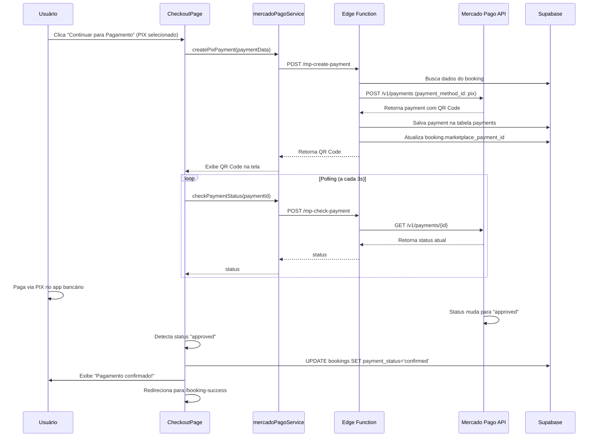

# Pagamento PIX Direto - Mercado Pago

## 📋 Resumo da Implementação

Foi implementado o sistema de pagamento PIX direto no Mercado Pago, permitindo que o cliente pague sem sair do site através de QR Code inline, com verificação automática de status.

## 🎯 Funcionalidades Implementadas

### 1. **Pagamento PIX Inline**
- ✅ QR Code gerado e exibido diretamente na página
- ✅ Código PIX "copia e cola" disponível
- ✅ Sem redirecionamento para página externa
- ✅ Interface limpa e intuitiva

### 2. **Verificação Automática de Status**
- ✅ Polling automático a cada 3 segundos
- ✅ Atualização instantânea ao confirmar pagamento
- ✅ Notificação visual ao usuário
- ✅ Redirecionamento automático após aprovação

### 3. **Integração Backend**
- ✅ Edge Function `mp-create-payment` para criar pagamento PIX
- ✅ Edge Function `mp-check-payment` para verificar status
- ✅ Registro automático na tabela `payments`
- ✅ Atualização do status do booking

## 📂 Arquivos Modificados/Criados

### Frontend

#### **`src/lib/mercadoPagoService.js`**
Novos métodos adicionados:

```javascript
// Cria pagamento PIX direto (retorna QR Code)
static async createPixPayment(paymentData)

// Verifica status do pagamento
static async checkPaymentStatus(paymentId)
```

#### **`src/pages/CheckoutPage.jsx`**
Modificações principais:

- **Novos estados:**
  ```javascript
  const [pixPayment, setPixPayment] = useState(null);
  const [pollingInterval, setPollingInterval] = useState(null);
  ```

- **Função `handlePayment` refatorada:**
  - Se PIX → chama `createPixPayment()` (QR Code inline)
  - Outros métodos → chama `createPreference()` (redirecionamento)

- **Nova função `startPaymentPolling()`:**
  - Verifica status a cada 3 segundos
  - Para ao detectar aprovação/rejeição
  - Atualiza booking e redireciona

- **Nova função `updateBookingPaymentStatus()`:**
  - Atualiza status no Supabase
  - Marca como `confirmed` ao aprovar

- **useEffect para cleanup:**
  - Limpa interval ao desmontar componente
  - Previne memory leaks

### Backend (Edge Functions)

#### **`functions/mp-create-payment/index.ts`** ✨ NOVO
Cria pagamento PIX direto usando API do Mercado Pago:

**Fluxo:**
1. Recebe `booking_id`, `amount`, `description`, `payer`
2. Busca dados do booking no Supabase
3. Cria pagamento via `POST /v1/payments` (MP API)
4. Extrai QR Code da resposta
5. Salva pagamento na tabela `payments`
6. Retorna QR Code e dados do pagamento

**Retorna:**
```json
{
  "success": true,
  "payment_id": "123456789",
  "status": "pending",
  "qr_code": "00020126580014br.gov.bcb.pix...",
  "qr_code_base64": "iVBORw0KGgoAAAANSUhEUgAA...",
  "ticket_url": "https://www.mercadopago.com.br/payments/123/ticket"
}
```

#### **`functions/mp-check-payment/index.ts`** ✨ NOVO
Verifica status de um pagamento:

**Fluxo:**
1. Recebe `payment_id`
2. Consulta `GET /v1/payments/{id}` (MP API)
3. Retorna status atual

**Retorna:**
```json
{
  "success": true,
  "status": "approved",
  "status_detail": "accredited",
  "payment_method": "pix",
  "amount": 230.00
}
```

## 🚀 Deploy das Edge Functions

### 1. **Deploy via Supabase CLI**

```powershell
# Fazer login no Supabase
supabase login

# Linkar projeto
supabase link --project-ref seu-project-ref

# Deploy da função mp-create-payment
supabase functions deploy mp-create-payment

# Deploy da função mp-check-payment
supabase functions deploy mp-check-payment
```

### 2. **Configurar Variáveis de Ambiente**

Acessar Dashboard do Supabase → Edge Functions → Environment Variables:

```
MP_ACCESS_TOKEN=APP_USR-xxx (seu token do Mercado Pago)
SUPABASE_URL=https://xxx.supabase.co
SUPABASE_SERVICE_ROLE_KEY=eyJxxx (service role key)
```

### 3. **Verificar Deploy**

```powershell
# Testar função mp-create-payment
curl -i --location --request POST 'https://xxx.supabase.co/functions/v1/mp-create-payment' \
  --header 'Authorization: Bearer YOUR_ANON_KEY' \
  --header 'Content-Type: application/json' \
  --data '{"booking_id": "test-id", "amount": 100, "payer": {"name": "Test", "email": "test@test.com"}}'

# Testar função mp-check-payment
curl -i --location --request POST 'https://xxx.supabase.co/functions/v1/mp-check-payment' \
  --header 'Authorization: Bearer YOUR_ANON_KEY' \
  --header 'Content-Type: application/json' \
  --data '{"payment_id": "123456789"}'
```

## 🔄 Fluxo Completo de Pagamento PIX



## 🎨 Interface do Usuário

### Estado 1: Seleção de Método

- Usuário seleciona PIX
- Botão "Continuar para Pagamento" ativo

### Estado 2: QR Code Exibido

- QR Code centralizado (256x256px)
- Código copia-e-cola abaixo
- Botão "Copiar" para facilitar
- Mensagem "Aguardando pagamento..." com animação pulse
- Texto informativo sobre verificação automática

### Estado 3: Pagamento Aprovado

- Toast verde: "Pagamento confirmado!"
- Redirecionamento automático em 2 segundos

## 📊 Diferenças: Preference vs Payment

### Checkout Preference (ANTIGO - outros métodos)
```javascript
// Redireciona usuário para página do MP
POST /checkout/preferences
→ Retorna init_point
→ window.location.href = init_point
```

**Usado para:**
- Cartão de crédito
- Cartão de débito
- Boleto bancário

### Payment Creation (NOVO - PIX)
```javascript
// Gera QR Code inline, sem redirecionamento
POST /v1/payments
→ Retorna qr_code + qr_code_base64
→ Exibe QR Code na própria página
→ Polling de status
```

**Usado para:**
- PIX (pagamento instantâneo)

## 🔐 Segurança

### Proteções Implementadas

1. **Idempotency Key:**
   ```typescript
   'X-Idempotency-Key': `${booking_id}-${Date.now()}`
   ```
   - Previne duplicação de pagamentos

2. **Validações Backend:**
   - Verificação de booking existente
   - Validação de valor (amount > 0)
   - Autenticação via Service Role Key

3. **CORS Configurado:**
   - Headers permitem requests do frontend
   - Preflight (OPTIONS) tratado

4. **Limpeza de Interval:**
   - useEffect cleanup previne memory leak
   - Interval limpo ao desmontar ou aprovar

## 🧪 Testes

### Teste Manual

1. **Criar Agendamento:**
   - Faça um agendamento no sistema
   - Anote o `booking_id`

2. **Ir para Checkout:**
   - Acesse `/checkout?bookingId=xxx`
   - Selecione PIX

3. **Verificar QR Code:**
   - Clique em "Continuar para Pagamento"
   - QR Code deve aparecer em até 2 segundos
   - Console deve mostrar logs:
     ```
     🔵 Criando pagamento PIX direto...
     ✅ Pagamento PIX criado: {...}
     🔄 Iniciando polling do pagamento: 123456789
     ```

4. **Testar Pagamento (Sandbox):**
   - Use app de teste do Mercado Pago
   - Escaneie QR Code
   - Ou copie código e cole no simulador

5. **Verificar Aprovação:**
   - Após pagar, aguarde até 3 segundos
   - Console deve mostrar:
     ```
     📊 Status atual: approved
     ✅ Pagamento aprovado!
     ✅ Status do booking atualizado: confirmed
     ```
   - Toast verde aparece
   - Redirecionamento automático

### Teste via Console do Navegador

```javascript
// Simular criação de pagamento PIX
const result = await MercadoPagoService.createPixPayment({
  booking_id: 'test-booking-id',
  amount: 100,
  description: 'Teste PIX',
  payer: { name: 'João Silva', email: 'joao@test.com' }
});
console.log(result);

// Simular verificação de status
const status = await MercadoPagoService.checkPaymentStatus('123456789');
console.log(status);
```

## 🐛 Troubleshooting

### Problema: QR Code não aparece

**Sintoma:** Fica em "Gerando QR Code..." indefinidamente

**Possíveis causas:**
1. Edge Function não deployada
2. `MP_ACCESS_TOKEN` incorreto
3. Erro na API do Mercado Pago

**Solução:**
```powershell
# Verificar logs da Edge Function
supabase functions logs mp-create-payment

# Verificar variáveis de ambiente
supabase secrets list
```

### Problema: Polling não para após pagamento

**Sintoma:** Console continua mostrando "📊 Status atual: pending"

**Possíveis causas:**
1. Webhook do MP não configurado
2. Pagamento no ambiente errado (prod vs sandbox)
3. Delay na atualização do status pelo MP

**Solução:**
- Aguardar até 30 segundos (PIX pode ter delay)
- Verificar se pagamento foi feito no ambiente correto
- Consultar diretamente na API do MP

### Problema: Erro "booking_id required"

**Sintoma:** Toast vermelho com erro

**Causa:** `bookingId` não está na URL ou é inválido

**Solução:**
```javascript
// Verificar no console
console.log('Booking ID:', bookingId);

// URL deve ter: /checkout?bookingId=xxx
```

## 📝 Próximos Passos (Melhorias Futuras)

### 1. **Timeout de Pagamento**
```javascript
// Adicionar timeout de 10 minutos
setTimeout(() => {
  if (pollingInterval) {
    clearInterval(pollingInterval);
    toast({
      title: 'Tempo expirado',
      description: 'O QR Code expirou. Gere um novo para continuar.'
    });
  }
}, 10 * 60 * 1000); // 10 minutos
```

### 2. **Botão "Cancelar Pagamento"**
```jsx
<Button 
  variant="outline" 
  onClick={handleCancelPayment}
>
  Cancelar e escolher outro método
</Button>
```

### 3. **Histórico de Tentativas**
- Salvar tentativas de pagamento
- Exibir histórico no admin panel

### 4. **Notificação por Email**
- Enviar QR Code por email
- Link alternativo para pagamento

### 5. **Expiração Visual do QR Code**
```jsx
<div className="text-xs text-gray-500 mt-2">
  QR Code expira em: <Countdown seconds={600} />
</div>
```

## 📚 Documentação de Referência

- [Mercado Pago - Payments API](https://www.mercadopago.com.br/developers/pt/reference/payments/_payments/post)
- [Mercado Pago - PIX Documentation](https://www.mercadopago.com.br/developers/pt/docs/checkout-api/integration-configuration/integrate-with-pix)
- [Supabase Edge Functions](https://supabase.com/docs/guides/functions)
- [QR Code React Library](https://www.npmjs.com/package/qrcode.react)

## ✅ Checklist de Deploy

- [ ] Edge Function `mp-create-payment` deployada
- [ ] Edge Function `mp-check-payment` deployada
- [ ] Variável `MP_ACCESS_TOKEN` configurada
- [ ] Frontend atualizado com novo código
- [ ] Teste manual realizado (sandbox)
- [ ] Console sem erros
- [ ] QR Code aparecendo corretamente
- [ ] Polling funcionando
- [ ] Aprovação detectada automaticamente
- [ ] Redirecionamento funcionando
- [ ] Teste em produção (valores reais)

---

**Implementado por:** GitHub Copilot  
**Data:** 2025  
**Versão:** 1.0.0
