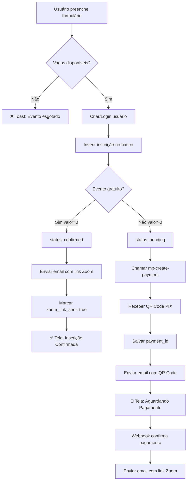

# ✅ STEP 4: Fluxo de Inscrição em Eventos - IMPLEMENTADO

**Data:** 29/10/2025  
**Arquivo modificado:** `src/pages/EventoDetalhePage.jsx`  
**Status:** ✅ COMPLETO

---

## 📋 Resumo das Implementações

### 1. **Validação de Vagas Disponíveis** ✅

Antes de permitir inscrição, o sistema agora:
- Verifica se `evento.vagas_disponiveis > 0` (0 = ilimitado)
- Conta inscrições confirmadas: `COUNT(*) WHERE status='confirmed'`
- Bloqueia inscrição se `vagasOcupadas >= vagas_disponiveis`
- Mostra toast: "Evento esgotado! 😢"

```javascript
if (event.vagas_disponiveis && event.vagas_disponiveis > 0) {
    const { count: vagasOcupadas } = await supabase
        .from('inscricoes_eventos')
        .select('*', { count: 'exact', head: true })
        .eq('evento_id', event.id)
        .eq('status', 'confirmed');

    if (vagasOcupadas >= event.vagas_disponiveis) {
        toast({ variant: "destructive", title: "Evento esgotado!" });
        return;
    }
}
```

---

### 2. **Status Inicial Baseado no Valor** ✅

#### Evento Gratuito (valor = 0):
- **status:** `'confirmed'` (confirmado imediatamente)
- **payment_status:** `null` (não há pagamento)
- **zoom_link_sent:** `true` (email enviado)

#### Evento Pago (valor > 0):
- **status:** `'pending'` (aguardando pagamento)
- **payment_status:** `'pending'` (pagamento pendente)
- **payment_id:** ID do Mercado Pago
- **zoom_link_sent:** `false` (aguarda webhook)

```javascript
const statusInicial = event.valor === 0 ? 'confirmed' : 'pending';
const paymentStatusInicial = event.valor === 0 ? null : 'pending';

const { data: inscricaoData } = await supabase.from('inscricoes_eventos').insert([{
    evento_id: event.id,
    user_id: userId,
    patient_name: patientData.name.trim(),
    patient_email: patientData.email.trim(),
    status: statusInicial,
    payment_status: paymentStatusInicial,
    valor_pago: event.valor || 0
}]).select();
```

---

### 3. **Email Templates por Tipo de Evento** ✅

#### 3.1 Evento Gratuito: `eventoGratuitoConfirmado()`
- ✅ Link da sala Zoom
- ✅ Senha de acesso
- ✅ Instruções de primeiro acesso ao Zoom
- ✅ Checklist de preparação
- ✅ Data/horário do evento

```javascript
if (event.valor === 0) {
    const emailHtml = emailTemplates.eventoGratuitoConfirmado(inscricao, event);
    
    await emailService.sendEmail({
        to: patientData.email.trim(),
        subject: `✅ Inscrição Confirmada - ${event.titulo}`,
        html: emailHtml,
        type: 'eventRegistration'
    });

    // Marcar email enviado
    await supabase
        .from('inscricoes_eventos')
        .update({ zoom_link_sent: true, zoom_link_sent_at: new Date().toISOString() })
        .eq('id', inscricao.id);
}
```

#### 3.2 Evento Pago: `eventoPagoAguardandoPagamento()`
- ✅ QR Code PIX (base64 inline)
- ✅ Código copia-e-cola
- ✅ Instruções de pagamento
- ✅ Aviso sobre vagas limitadas
- ❌ **NÃO inclui link Zoom** (enviado após pagamento)

```javascript
else {
    // Gerar PIX via Edge Function
    const { data: pixData } = await supabase.functions.invoke('mp-create-payment', {
        body: {
            transaction_amount: parseFloat(event.valor),
            description: `Inscrição - ${event.titulo}`,
            payment_method_id: 'pix',
            payer: { email: patientData.email.trim(), ... },
            external_reference: `EVENTO_${inscricao.id}`, // CRÍTICO: Prefixo EVENTO_
            notification_url: `${SUPABASE_URL}/functions/v1/mp-webhook`
        }
    });

    // Atualizar com payment_id
    await supabase
        .from('inscricoes_eventos')
        .update({ payment_id: pixData.id })
        .eq('id', inscricao.id);

    // Enviar email com QR Code
    const emailHtml = emailTemplates.eventoPagoAguardandoPagamento(inscricao, event, {
        qr_code_base64: pixData.point_of_interaction.transaction_data.qr_code_base64,
        qr_code: pixData.point_of_interaction.transaction_data.qr_code
    });

    await emailService.sendEmail({
        to: patientData.email.trim(),
        subject: `💳 Pagamento Pendente - ${event.titulo}`,
        html: emailHtml,
        type: 'eventPayment'
    });
}
```

---

### 4. **Geração de PIX para Eventos Pagos** ✅

#### Chamada à Edge Function `mp-create-payment`:
- **transaction_amount:** Valor do evento
- **description:** `"Inscrição - {titulo_evento}"`
- **payment_method_id:** `'pix'`
- **external_reference:** `EVENTO_{inscricao_id}` ⚠️ **CRÍTICO**
- **notification_url:** Webhook para confirmação automática

#### Retorno esperado:
```json
{
  "id": "123456789",
  "point_of_interaction": {
    "transaction_data": {
      "qr_code": "00020126580014br.gov.bcb.pix...",
      "qr_code_base64": "iVBORw0KGgoAAAANSUhEUgAA..."
    }
  }
}
```

---

### 5. **Mensagens de Confirmação Diferenciadas** ✅

#### Evento Gratuito:
```
✅ Inscrição Confirmada!

Sua vaga está confirmada! 🎉

📧 Email enviado com:
  • Link da sala Zoom
  • Senha de acesso
  • Instruções para primeiro acesso
  • Checklist de preparação

💚 Evento gratuito - Nenhum pagamento necessário

[Voltar para a Página Inicial]
```

#### Evento Pago:
```
📧 Inscrição Registrada!

Enviamos um email com o QR Code PIX para pagamento.

⏰ Próximos passos:
  1. Abra o email e escaneie o QR Code
  2. Realize o pagamento via PIX
  3. Aguarde a confirmação automática (até 5 minutos)
  4. Você receberá um novo email com o link da sala Zoom

💡 Valor: R$ 150,00

[Voltar para a Página Inicial]
```

---

## 🔄 Fluxo Completo de Inscrição



---

## 🎯 Requisitos Atendidos

✅ **"Cada evento deve gerar uma sala no zoom"**  
→ Step 3: AdminPage cria Zoom automaticamente

✅ **"Esse link deve ser enviado ao participante"**  
→ Step 4: Email enviado via `emailTemplates.eventoGratuitoConfirmado()`

✅ **"Eventos gratuitos link enviado imediatamente"**  
→ Step 4: `if (valor === 0)` envia email com Zoom na hora

✅ **"Eventos pagos link enviado após pagamento"**  
→ Step 4: Email com QR Code → Webhook (Step 5) → Email com Zoom

✅ **"Validar vagas disponíveis"**  
→ Step 4: Verifica `COUNT(status='confirmed') < vagas_disponiveis`

---

## 🔒 Segurança Implementada

1. **Prefixo `EVENTO_` no external_reference**  
   → Permite webhook identificar pagamentos de eventos vs consultas

2. **Status initial correto**  
   → Gratuito: `confirmed` | Pago: `pending`

3. **Validação de vagas ANTES da inscrição**  
   → Evita overbooking

4. **Tratamento de erros não-bloqueantes**  
   → Email/PIX falha mas inscrição é salva

5. **Zoom link enviado APENAS após confirmação**  
   → Eventos pagos: aguarda webhook do Mercado Pago

---

## 📊 Campos Atualizados na Inscrição

| Campo | Evento Gratuito | Evento Pago |
|-------|----------------|-------------|
| `status` | `'confirmed'` | `'pending'` → `'confirmed'` (webhook) |
| `payment_status` | `null` | `'pending'` → `'approved'` (webhook) |
| `payment_id` | `null` | ID do Mercado Pago |
| `payment_date` | `null` | Timestamp do webhook |
| `valor_pago` | `0` | Valor do evento |
| `zoom_link_sent` | `true` (imediato) | `false` → `true` (webhook) |
| `zoom_link_sent_at` | Timestamp | Timestamp do webhook |

---

## 🚀 Próximos Passos

### **STEP 5: Webhook Mercado Pago (PRÓXIMO)** ⏳
- Arquivo: `supabase/functions/mp-webhook/index.ts`
- Detectar prefixo `EVENTO_` no `external_reference`
- Atualizar `status='confirmed'` e `payment_status='approved'`
- Enviar email com `emailTemplates.eventoPagoConfirmado()`
- Marcar `zoom_link_sent=true`

### **STEP 6: Página de Inscrições do Usuário** ⏳
- Arquivo: `src/pages/MinhasInscricoesPage.jsx` (criar)
- Listar eventos inscritos do usuário
- Mostrar status e detalhes do evento
- Exibir link Zoom **somente se** `status='confirmed'`
- Badge de status: Confirmado, Pendente, Cancelado

---

## 📝 Logs e Debug

### Console logs adicionados:
```javascript
✅ Vagas disponíveis: 15 de 20
✅ Inscrição registrada: { id: 'uuid', status: 'confirmed', ... }
✅ Email gratuito com link Zoom enviado
💳 Gerando pagamento PIX para evento...
✅ PIX gerado com sucesso: 123456789
✅ Email com QR Code PIX enviado
```

### Em caso de erro:
```javascript
⚠️ Erro ao enviar email (não crítico): [erro]
❌ Erro ao processar pagamento PIX: [erro]
```

---

## ✅ STEP 4 COMPLETO

**Arquivos modificados:**
- ✅ `src/pages/EventoDetalhePage.jsx` (linhas 1, 265-500)

**Funcionalidades adicionadas:**
- ✅ Validação de vagas disponíveis
- ✅ Status inicial baseado no valor
- ✅ Email com Zoom para eventos gratuitos
- ✅ Geração de PIX para eventos pagos
- ✅ Email com QR Code PIX
- ✅ Mensagens de confirmação diferenciadas
- ✅ Tratamento de erros não-bloqueantes

**Pronto para:** STEP 5 - Webhook Mercado Pago
