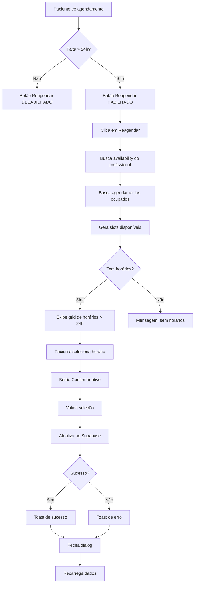

# 📅 Sistema de Reagendamento - Doxologos

**Data:** 28/10/2025  
**Arquivo:** `src/pages/PacientePage.jsx`  
**Status:** ✅ IMPLEMENTADO E VALIDADO

---

## 🎯 FUNCIONALIDADE

Sistema completo de reagendamento de consultas para pacientes, permitindo alterar data e horário de agendamentos futuros diretamente pela área do paciente, **respeitando a agenda do profissional** e **com antecedência mínima de 24 horas**.

---

## ✨ RECURSOS IMPLEMENTADOS

### **1. Interface de Reagendamento** ✅
- Dialog modal responsivo
- Visualização do agendamento atual
- Grid de horários disponíveis
- Seleção visual de novo horário
- Confirmação com feedback
- Aviso sobre regra de 24h

### **2. Lógica de Negócio** ✅
- ✅ **Antecedência mínima de 24h** (nova regra)
- ✅ **Respeita agenda do profissional** (availability)
- Busca automática de horários disponíveis (próximos 30 dias)
- Filtragem de horários já ocupados
- Horários baseados na disponibilidade configurada
- Validação antes de confirmar

### **3. Regras de Uso** ✅
- ⏰ **Reagendamento só até 24h antes da consulta**
- ✅ Apenas agendamentos futuros podem ser reagendados
- ✅ Não é possível reagendar consultas canceladas
- ✅ Não é possível reagendar consultas passadas
- ✅ Horários ocupados não aparecem na lista
- ✅ Respeita dias e horários de trabalho do profissional

---

## 🔧 IMPLEMENTAÇÃO TÉCNICA

### **Estados Adicionados**
```javascript
const [reschedulingBooking, setReschedulingBooking] = useState(null);
const [availableSlots, setAvailableSlots] = useState([]);
const [loadingSlots, setLoadingSlots] = useState(false);
const [selectedNewSlot, setSelectedNewSlot] = useState(null);
```

### **Funções Criadas**

#### **1. canReschedule(booking)** ⭐ NOVA
**Propósito:** Valida se o agendamento pode ser reagendado

**Validações:**
1. Verifica se não está cancelado
2. Calcula diferença de horas entre agora e o agendamento
3. Retorna `true` apenas se > 24h

```javascript
const canReschedule = (booking) => {
    if (booking.status === 'cancelled_by_patient' || 
        booking.status === 'cancelled_by_professional') {
        return false;
    }
    
    const bookingDateTime = new Date(`${booking.booking_date}T${booking.booking_time}`);
    const now = new Date();
    const hoursDifference = (bookingDateTime - now) / (1000 * 60 * 60);
    
    return hoursDifference > 24; // Mínimo 24h
};
```

#### **2. fetchAvailableSlots(professionalId, serviceId)** ⭐ ATUALIZADA
**Propósito:** Busca horários disponíveis respeitando a agenda do profissional

**Processo:**
1. **Busca disponibilidade do profissional** (tabela `professionals.availability`)
2. Busca agendamentos existentes (próximos 30 dias)
3. Filtra status válidos: `confirmed`, `paid`, `pending_payment`
4. **Gera slots baseados na agenda configurada**:
   - Dias de trabalho do profissional (ex: seg-sex)
   - Horários de início e fim (ex: 8h-18h)
   - Exclui horários já ocupados
   - **Exclui horários com menos de 24h de antecedência**

**Exemplo de availability do profissional:**
```json
{
  "monday": { "available": true, "start": "08:00", "end": "18:00" },
  "tuesday": { "available": true, "start": "08:00", "end": "18:00" },
  "wednesday": { "available": true, "start": "08:00", "end": "18:00" },
  "thursday": { "available": true, "start": "08:00", "end": "18:00" },
  "friday": { "available": true, "start": "08:00", "end": "17:00" },
  "saturday": { "available": false },
  "sunday": { "available": false }
}
```

**Retorno:**
```javascript
[
  {
    date: '2025-10-30',
    time: '09:00:00',
    display: 'qua, 30 out às 9:00'
  },
  // Apenas horários > 24h e dentro da agenda
]
```

#### **3. startReschedule(booking)**
**Propósito:** Inicia o processo de reagendamento

**Ações:**
1. Define o agendamento sendo reagendado
2. Reseta seleção anterior
3. Busca horários disponíveis (com availability)
4. Abre o dialog

#### **4. confirmReschedule()**
**Propósito:** Confirma o reagendamento

**Validações:**
- Verifica se há horário selecionado
- Verifica se há agendamento sendo reagendado

**Processo:**
1. Atualiza registro no Supabase:
   - `booking_date` → nova data
   - `booking_time` → novo horário
   - `updated_at` → timestamp
2. Exibe toast de sucesso
3. Fecha dialog
4. Recarrega dados

**Logs:**
```javascript
logger.info('Confirming reschedule', { bookingId, newDate, newTime });
logger.success('Booking rescheduled successfully', { bookingId });
```

---

## 🎨 INTERFACE DO USUÁRIO

### **Botão de Reagendamento**
- Aparece apenas para agendamentos futuros não cancelados
- Ícone de calendário
- Ação: Abre dialog de reagendamento

### **Dialog de Reagendamento**
```
┌─────────────────────────────────────┐
│ Reagendar Consulta                  │
├─────────────────────────────────────┤
│ [Box] Agendamento Atual:            │
│ Data: 30/10/2025 às 14:00           │
│ Profissional: Dr. João Silva        │
├─────────────────────────────────────┤
│ Selecione o novo horário:           │
│                                     │
│ ┌─────────┐ ┌─────────┐            │
│ │ter, 29  │ │qua, 30  │            │
│ │às 9:00  │ │às 10:00 │            │
│ └─────────┘ └─────────┘            │
│ ┌─────────┐ ┌─────────┐            │
│ │qui, 31  │ │sex, 01  │            │
│ │às 11:00 │ │às 14:00 │            │
│ └─────────┘ └─────────┘            │
│                                     │
├─────────────────────────────────────┤
│         [Cancelar] [Confirmar]      │
└─────────────────────────────────────┘
```

### **Estados Visuais**

#### **Loading**
```
┌─────────────────────┐
│   [Spinner]         │
│ Carregando          │
│ horários...         │
└─────────────────────┘
```

#### **Sem Horários**
```
Nenhum horário disponível
nos próximos 30 dias.
```

#### **Horário Selecionado**
```
┌─────────────────┐
│ ✓ ter, 29 out   │ ← Borda verde
│   às 9:00       │ ← Fundo verde claro
└─────────────────┘
```

#### **Horário Não Selecionado**
```
┌─────────────────┐
│   qua, 30 out   │ ← Borda cinza
│   às 10:00      │ ← Fundo branco
└─────────────────┘
```

---

## 📊 FLUXO DE REAGENDAMENTO



---

## 🔍 VALIDAÇÕES

### **1. Validações de Exibição**
```javascript
// Botão só aparece se:
canReschedule(booking) // que valida:
// - Não cancelado
// - Diferença > 24h
```

### **2. Validações de Negócio**
- ✅ **Antecedência mínima 24h** (validado em 2 pontos)
- ✅ Apenas dias configurados na agenda do profissional
- ✅ Apenas horários de trabalho do profissional
- ✅ Exclui horários já ocupados
- ✅ Apenas próximos 30 dias

### **3. Validações de Dados**
```javascript
// Verifica availability do profissional
const dayAvailability = availability[dayName];
if (!dayAvailability || !dayAvailability.available) continue;

// Verifica 24h de antecedência
const hoursFromNow = (slotDateTime - new Date()) / (1000 * 60 * 60);
if (hoursFromNow > 24) { /* incluir slot */ }
```

### **4. Validações de Confirmação**
```javascript
if (!selectedNewSlot || !reschedulingBooking) return;
```

---

## 🎯 CASOS DE USO

### **Caso 1: Reagendamento Bem-Sucedido**
```
1. Paciente acessa Área do Paciente
2. Vê lista de agendamentos
3. Clica em "Reagendar" em consulta futura
4. Dialog abre com horários disponíveis
5. Seleciona novo horário
6. Clica em "Confirmar Reagendamento"
7. Sistema atualiza agendamento
8. Toast de sucesso aparece
9. Lista de agendamentos é atualizada
```

### **Caso 2: Sem Horários Disponíveis**
```
1. Paciente clica em "Reagendar"
2. Sistema busca horários
3. Nenhum horário disponível
4. Mensagem: "Nenhum horário disponível nos próximos 30 dias"
5. Paciente deve entrar em contato
```

### **Caso 3: Erro ao Reagendar**
```
1. Paciente seleciona novo horário
2. Clica em "Confirmar"
3. Erro na comunicação com servidor
4. Toast de erro: "Não foi possível reagendar"
5. Paciente pode tentar novamente
```

---

## 📝 QUERY DO SUPABASE

### **Buscar Horários Ocupados**
```sql
SELECT booking_date, booking_time
FROM bookings
WHERE professional_id = ?
  AND status IN ('confirmed', 'paid', 'pending_payment')
  AND booking_date >= CURRENT_DATE
  AND booking_date <= CURRENT_DATE + INTERVAL '30 days'
```

### **Atualizar Agendamento**
```sql
UPDATE bookings
SET booking_date = ?,
    booking_time = ?,
    updated_at = CURRENT_TIMESTAMP
WHERE id = ?
```

---

## 🐛 TRATAMENTO DE ERROS

### **Erro ao Buscar Horários**
```javascript
logger.error('Error fetching available slots', error);
toast({
  variant: 'destructive',
  title: 'Erro ao buscar horários',
  description: 'Não foi possível carregar os horários disponíveis.'
});
```

### **Erro ao Confirmar Reagendamento**
```javascript
logger.error('Error rescheduling booking', error);
toast({
  variant: 'destructive',
  title: 'Erro ao reagendar',
  description: 'Não foi possível reagendar o horário. Tente novamente.'
});
```

---

## 🚀 MELHORIAS FUTURAS

### **Fase 2** (Opcional)
- [ ] Notificação por email do reagendamento
- [ ] SMS de confirmação
- [ ] Limite de reagendamentos (ex: máx 2 por consulta)
- [ ] Taxa de reagendamento (se aplicável)
- [ ] Histórico de reagendamentos

### **Fase 3** (Avançado)
- [ ] Sugestão inteligente de horários
- [ ] Reagendamento em massa
- [ ] Integração com Google Calendar
- [ ] Lembrete automático antes da consulta

---

## 🧪 TESTES RECOMENDADOS

### **1. Teste de Fluxo Completo**
```bash
1. Login como paciente
2. Verificar agendamento futuro
3. Clicar em "Reagendar"
4. Verificar horários carregados
5. Selecionar novo horário
6. Confirmar reagendamento
7. Verificar atualização na lista
```

### **2. Teste de Validações**
```bash
# Teste 1: Consulta passada
- Botão "Reagendar" não deve aparecer

# Teste 2: Consulta cancelada
- Botão "Reagendar" não deve aparecer

# Teste 3: Sem horários
- Mensagem adequada deve ser exibida

# Teste 4: Horário já ocupado
- Não deve aparecer na lista
```

### **3. Teste de Erros**
```bash
# Teste 1: Desconectar internet
- Toast de erro deve aparecer

# Teste 2: Banco de dados offline
- Mensagem de erro amigável
```

---

## 📈 MÉTRICAS DE SUCESSO

### **KPIs**
- Taxa de reagendamentos bem-sucedidos (%)
- Tempo médio para reagendar (segundos)
- Taxa de erro (%)
- Número de reagendamentos por paciente

### **Analytics**
```javascript
// Adicionar tracking (futuro)
analytics.trackEvent('reschedule_started', {
  event_category: 'Booking',
  booking_id: bookingId
});

analytics.trackEvent('reschedule_completed', {
  event_category: 'Booking',
  booking_id: bookingId,
  days_difference: daysDiff
});
```

---

## ✅ CHECKLIST DE IMPLEMENTAÇÃO

- [x] Estados criados
- [x] Função fetchAvailableSlots implementada
- [x] Função startReschedule implementada
- [x] Função confirmReschedule implementada
- [x] Dialog UI implementado
- [x] Grid de horários implementado
- [x] Validações adicionadas
- [x] Logs implementados
- [x] Tratamento de erros implementado
- [x] Toast notifications configurados
- [x] Responsividade testada
- [x] Sem erros no console

---

## 📞 SUPORTE

### **Problemas Conhecidos**
- Nenhum problema conhecido no momento

### **FAQ**

**P: Posso reagendar uma consulta cancelada?**
R: Não. Consultas canceladas não podem ser reagendadas. É necessário fazer um novo agendamento.

**P: Quantas vezes posso reagendar?**
R: Não há limite no momento, mas recomendamos evitar reagendamentos excessivos.

**P: E se não houver horários disponíveis?**
R: Entre em contato conosco pelo WhatsApp ou email para verificar disponibilidade.

**P: O reagendamento é cobrado?**
R: Não. O reagendamento é gratuito desde que feito com antecedência mínima.

---

**Implementado por:** GitHub Copilot  
**Data:** 28/10/2025  
**Status:** ✅ Pronto para uso em produção
